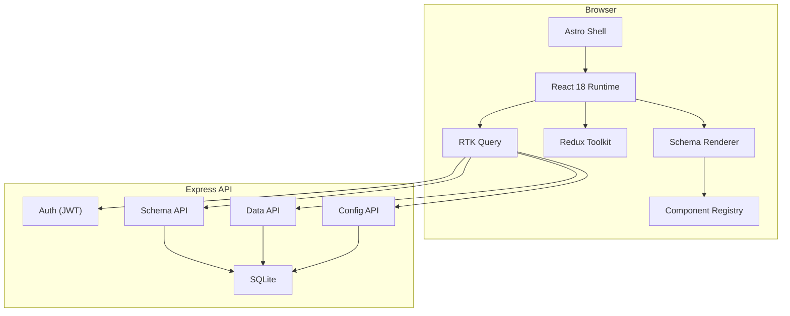
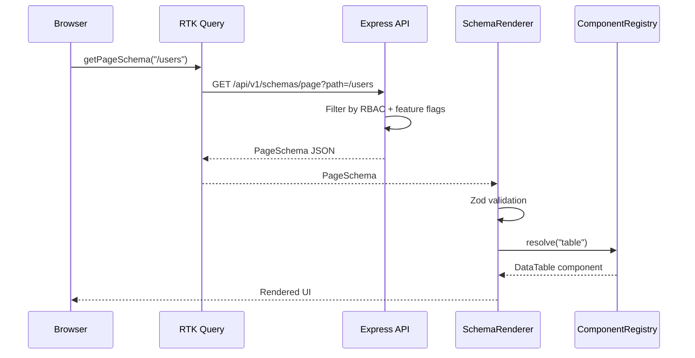
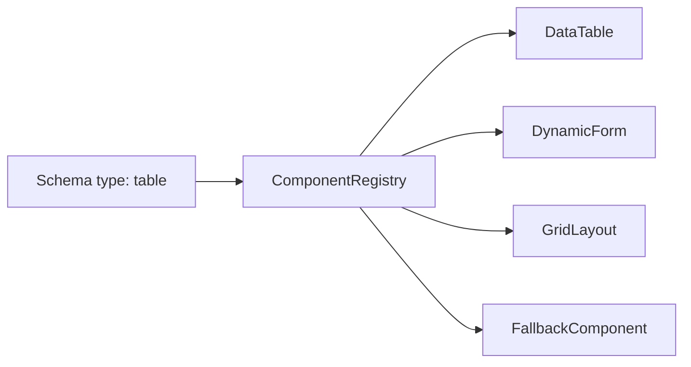
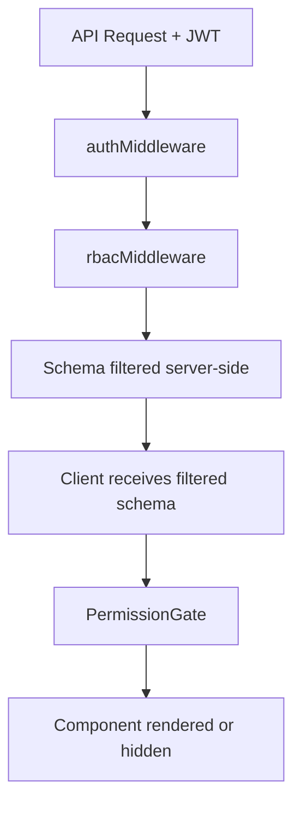
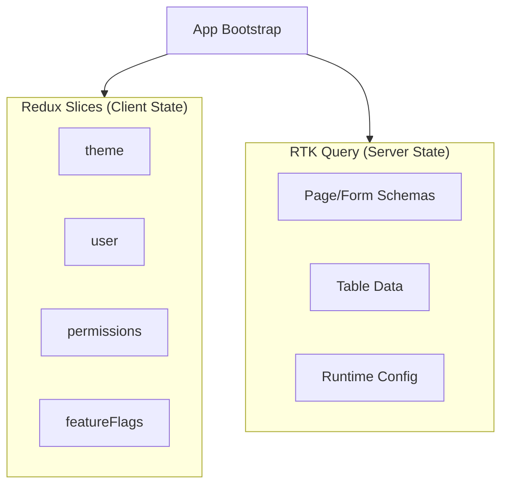

# Server Driven UI Platform

> A production-grade platform where the backend controls UI rendering via JSON schemas.

Build internal admin platforms, CRM systems, enterprise dashboards, and configuration-driven applications without redeploying the frontend for every page change.

## Quick Start

### Prerequisites

- Node.js 20+
- npm 10+

### Install & Run

```bash
npm install
npm run build -w @sdui/shared
npm run db:seed -w @sdui/api
npm run dev
```

- **Frontend:** http://localhost:4321
- **API:** http://localhost:3001

### Demo Credentials

| Role    | Email               | Password   |
|---------|---------------------|------------|
| Admin   | admin@example.com   | admin123   |
| Manager | manager@example.com | manager123 |
| User    | user@example.com    | user123    |
| Viewer  | viewer@example.com  | viewer123  |

### Scripts

| Command | Description |
|---------|-------------|
| `npm run dev` | Start API + Web (Turborepo) |
| `npm run build` | Build all packages |
| `npm run test` | Run unit + integration tests |
| `npm run test:e2e` | Run Playwright E2E tests |
| `npm run db:seed` | Seed SQLite database |

---

## What is Server Driven UI?

**What it is:** A pattern where the backend sends JSON schemas describing pages, layouts, forms, and components. The frontend interprets these schemas at runtime through a generic rendering engine — no page-specific React components.

**Why we used it:** Enterprise admin platforms change frequently. Product teams need to add pages, modify forms, and adjust permissions without frontend deploys. SDUI centralizes UI structure on the server.

**Alternatives:**
- **Traditional SPA** — Hardcoded routes and pages per feature
- **CMS-driven UI** (Contentful, Sanity) — Content-focused, not application-focused
- **Micro-frontends** — Team autonomy but high integration cost

**Tradeoffs:**

| Benefit | Cost |
|---------|------|
| Backend controls UI without frontend deploys | Runtime schema validation required |
| Consistent rendering via registry | Less compile-time type safety for pages |
| Permission/flag gating in one place | Network dependency for UI structure |
| Rapid page iteration | Backend schema complexity grows |

---

## Architecture

### System Diagram



### Schema Flow



### Component Registry



### Permission Flow



### State Management



---

## Core Concepts

### 1. Component Registry Pattern

**What:** A `Map<type, Component>` that maps schema type strings to React components.

**Why:** Open/Closed Principle — add new component types without modifying the renderer.

**Alternatives:** Switch/case, dynamic imports by string (security risk).

**Tradeoffs:** Requires registration discipline; unknown types need fallback handling.

### 2. Dynamic Routing

**What:** Astro catch-all route `[...slug].astro` + client-side path resolution. Routes listed in `getStaticPaths` for build; navigation driven by server config.

**Why:** New backend pages don't require frontend route code.

**Alternatives:** React Router with codegen, Next.js dynamic routes.

**Tradeoffs:** Static build needs route list; fully dynamic routes require SSR mode.

### 3. Dynamic Form Generation

**What:** Backend sends field schemas → `buildZodSchema()` → React Hook Form + Zod resolver.

**Why:** Forms change frequently; validation rules belong with schema.

**Alternatives:** JSON Schema Form libraries, hardcoded forms.

**Tradeoffs:** Complex conditional logic harder to express in schema.

### 4. Feature Flags

**What:** Runtime toggles from `/api/v1/config/runtime`. Components reference `featureFlag` in schema.

**Why:** Enable/disable features without redeployment.

**Alternatives:** LaunchDarkly, environment variables.

**Tradeoffs:** Flag proliferation; requires server-side flag management.

### 5. RBAC

**What:** Four roles (Admin, Manager, User, Viewer) with permission strings. Enforced server-side and client-side.

**Why:** Defense in depth — server filters schemas; client gates rendering.

**Alternatives:** ABAC, policy engines (OPA).

**Tradeoffs:** Permission string proliferation; role hierarchy is flat.

### 6. Permission Based Rendering

**What:** `PermissionGate` wraps every schema node. Checks `permissions.view|edit|delete|create|execute`.

**Why:** Hide UI elements users cannot use — better UX and security.

**Alternatives:** Render all, disable buttons, server-only filtering.

**Tradeoffs:** Client-side checks are not security boundaries alone.

### 7. Runtime Configuration

**What:** Theme, branding, menu, flags, permissions loaded at boot from config API.

**Why:** Single source of truth; no rebuild for config changes.

**Alternatives:** Build-time env vars, remote config services.

**Tradeoffs:** Boot-time network dependency; cache invalidation complexity.

---

## Project Structure

```
server-driven-ui/
├── apps/
│   ├── api/          # Express + SQLite backend
│   │   ├── src/
│   │   │   ├── data/         # Seed schemas (pages, forms)
│   │   │   ├── db/           # SQLite setup + seed
│   │   │   ├── routes/       # REST endpoints
│   │   │   └── services/     # Business logic
│   └── web/          # Astro + React frontend
│       └── src/
│           ├── core/         # SDUI engine (renderer, registry)
│           ├── components/   # Registered UI components
│           ├── features/       # Auth, permissions, flags
│           ├── store/          # Redux + RTK Query
│           └── islands/        # React entry points
├── packages/
│   └── shared/       # Shared types + Zod validators
└── turbo.json        # Turborepo task orchestration
```

| Directory | Purpose |
|-----------|---------|
| `core/` | Framework-agnostic SDUI engine |
| `components/` | Registry-mapped Mantine components |
| `store/slices/` | Client state only (theme, user, permissions, flags) |
| `store/api/` | RTK Query — all server state |
| `packages/shared/` | Schema types shared by API and web |

---

## Tech Stack

| Layer | Technology | Rationale |
|-------|------------|-----------|
| Shell | Astro | Fast static shell, minimal JS |
| UI Runtime | React 18 | Component ecosystem, hooks |
| Design System | Mantine UI | Enterprise components, a11y |
| Client State | Redux Toolkit | Theme, user, permissions, flags |
| Server State | RTK Query | Schema/data caching |
| Forms | React Hook Form + Zod | Schema-driven validation |
| Backend | Express + TypeScript | Simple, well-understood API layer |
| Database | SQLite | Zero-config persistence for demo |
| Auth | JWT | Stateless API authentication |
| Monorepo | npm workspaces + Turborepo | Shared types, parallel builds |
| Testing | Vitest, RTL, Playwright | Unit → integration → E2E |
| Monitoring | Sentry | Error tracking (stub in dev) |

---

## React & Architecture Patterns

| Pattern | Location | Purpose |
|---------|----------|---------|
| `React.memo` | StatCard, DataTable, fields | Prevent unnecessary re-renders |
| `useMemo` | SchemaRenderer, DynamicPage | Cache derived props |
| `useCallback` | Action handlers, navigation | Stable refs for memoized children |
| `useReducer` | DynamicForm submit state | Complex form submission flow |
| `useRef` | FormModal focus trap | Imperative DOM access |
| Context API | SchemaContext, FormProvider | Avoid prop drilling in trees |
| Custom Hooks | usePermission, useFeatureFlag | Reusable permission/flag logic |
| Suspense | SchemaRenderer | Lazy-loaded Chart component |
| `React.lazy` | ChartWidget | Code splitting |
| Error Boundaries | App + per-component | Isolate rendering failures |
| Compound Components | TabsLayout | Flexible tab composition |

---

## Development Guide

### Adding a New Component Type

1. Create component in `apps/web/src/components/`
2. Register in `core/registry/registerComponents.ts`
3. Add Zod validator in `packages/shared/src/validators/`
4. Use in backend page schema JSON

### Adding a New Page (No Frontend Code)

1. Add `PageSchema` to `apps/api/src/data/pageSchemas.ts`
2. Run `npm run db:seed -w @sdui/api`
3. Add route to `apps/web/src/pages/[...slug].astro` `getStaticPaths`
4. Add navigation item in `schemaService.ts` `getNavigation()`

### Adding a Permission

1. Add permission string to `ROLE_PERMISSIONS` in `packages/shared`
2. Reference in schema `permissions` field
3. Add `requirePermission()` middleware on API routes

---

## Testing

```bash
# Unit + integration
npm run test

# E2E (starts API + Web automatically)
npm run test:e2e -w @sdui/web
```

| Layer | Coverage |
|-------|----------|
| ComponentRegistry | register, resolve, fallback |
| PermissionGate | permission + feature flag gating |
| buildZodSchema | field validation rules |
| E2E | routing, RBAC, navigation |

---

## API Reference

| Method | Endpoint | Description |
|--------|----------|-------------|
| POST | `/api/v1/auth/login` | JWT login |
| GET | `/api/v1/auth/me` | Current user |
| GET | `/api/v1/config/runtime` | Theme, flags, permissions |
| GET | `/api/v1/config/navigation` | Sidebar menu |
| GET | `/api/v1/schemas/page?path=` | Page schema |
| GET | `/api/v1/schemas/form?id=` | Form schema |
| GET | `/api/v1/data/:resource` | CRUD data |

---

## License

MIT
